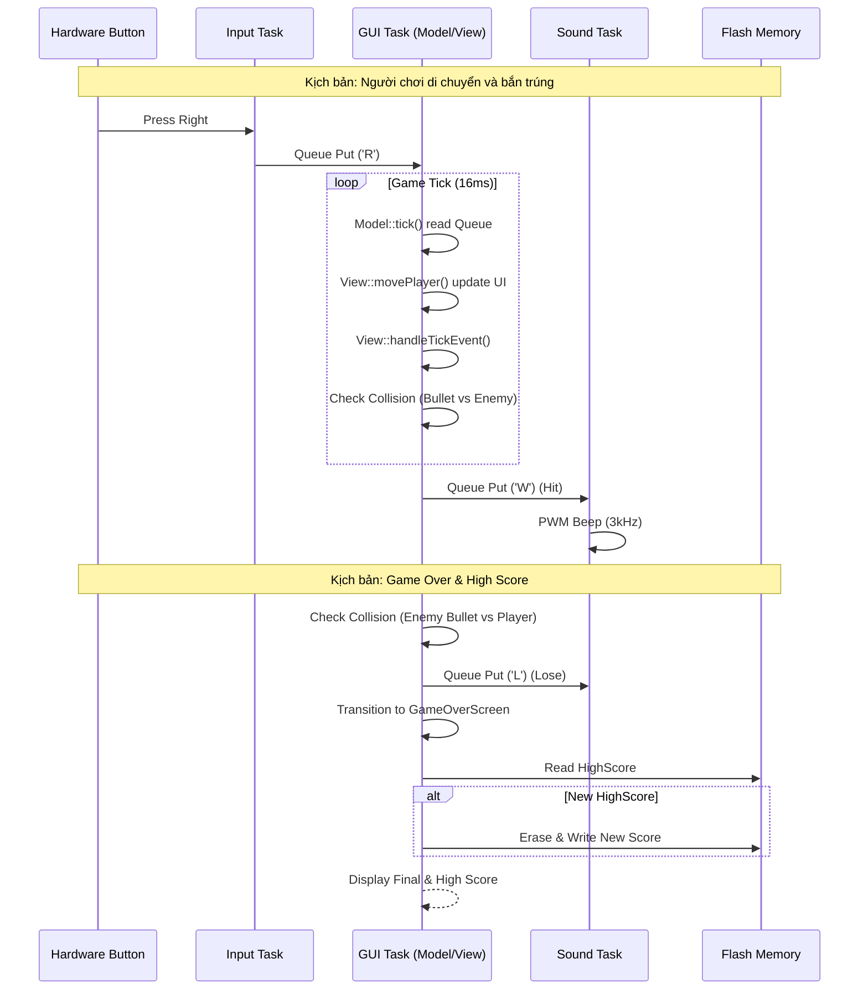

```mermaid
sequenceDiagram
    participant Button as Hardware Button
    participant InputTask as Input Task
    participant GUI as GUI Task (Model/View)
    participant Sound as Sound Task
    participant Flash as Flash Memory

    Note over Button, Flash: Kịch bản: Người chơi di chuyển và bắn trúng
    Button->>InputTask: Press Right
    InputTask->>GUI: Queue Put ('R')
    loop Game Tick (16ms)
        GUI->>GUI: Model::tick() read Queue
        GUI->>GUI: View::movePlayer() update UI
        GUI->>GUI: View::handleTickEvent()
        GUI->>GUI: Check Collision (Bullet vs Enemy)
    end
    GUI->>Sound: Queue Put ('W') (Hit)
    Sound->>Sound: PWM Beep (3kHz)

    Note over Button, Flash: Kịch bản: Game Over & High Score
    GUI->>GUI: Check Collision (Enemy Bullet vs Player)
    GUI->>Sound: Queue Put ('L') (Lose)
    GUI->>GUI: Transition to GameOverScreen
    GUI->>Flash: Read HighScore
    alt New HighScore
        GUI->>Flash: Erase & Write New Score
    end
    GUI-->>GUI: Display Final & High Score
```
